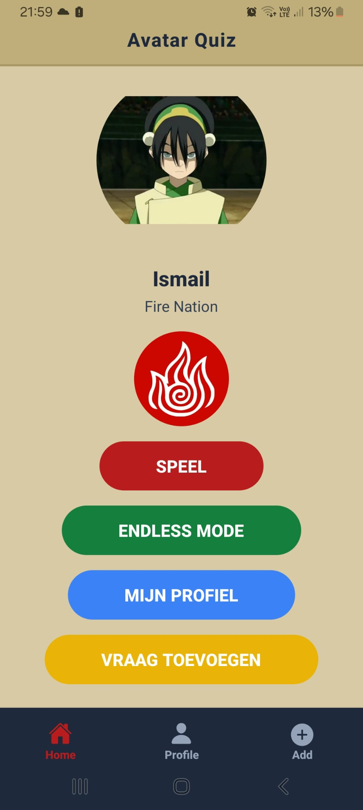
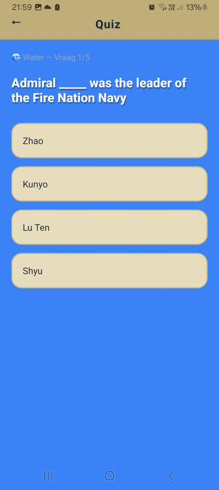
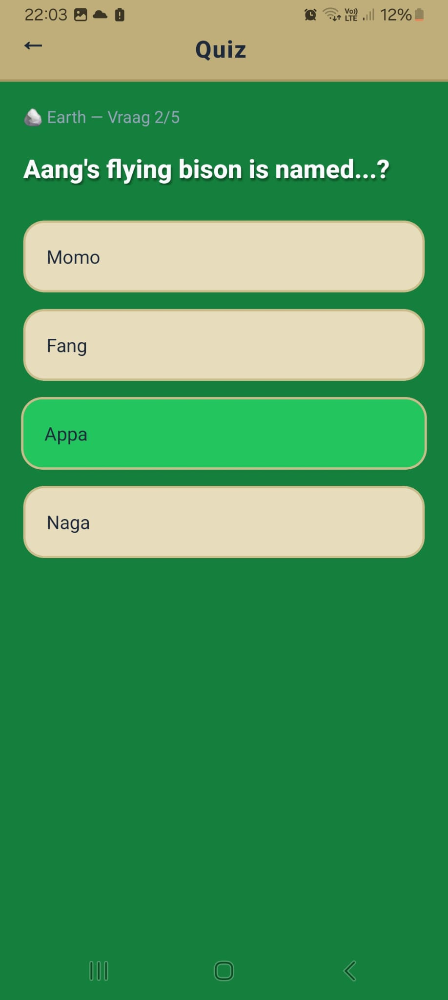
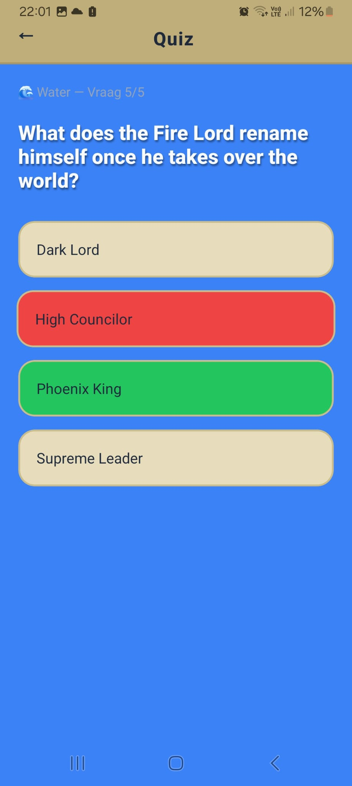
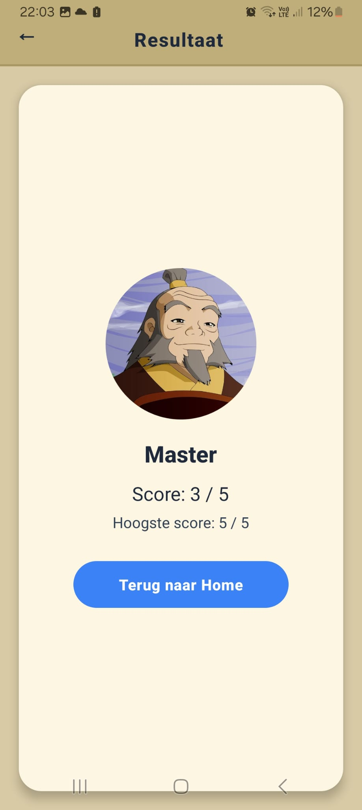
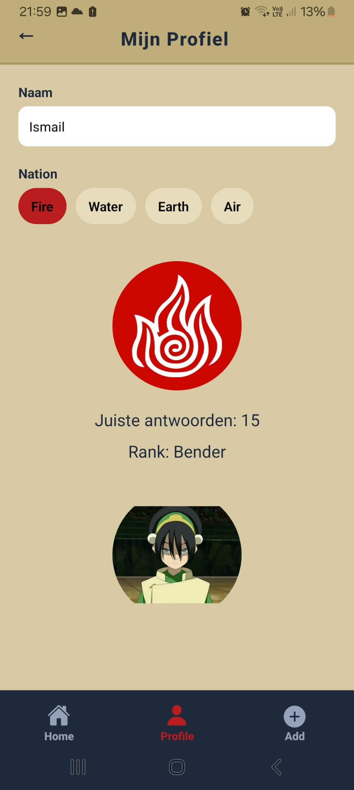
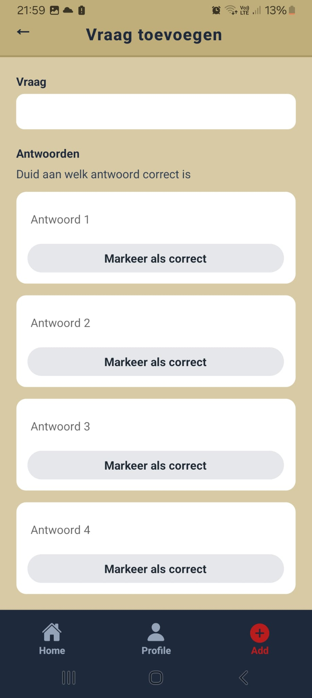
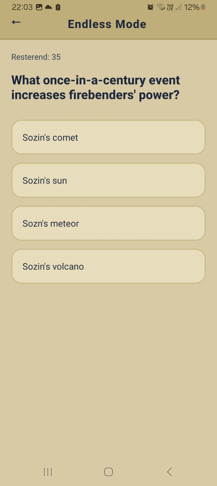

# How to use:
   
   1.
   > npm install 

   2.
   > npx expo start

# AvatarProject — React Native (Expo) Quiz App

Mobiele quiz-app in **React Native + TypeScript** gebouwd met **Expo** en **expo-router**.
De app gebruikt de **Avatar: The Last Airbender** vragen-API om quizvragen op te halen en bevat meerdere schermen, state management, persistente opslag en extra Expo-modules voor UX.

---

## Overzicht
Deze app is een quiz-game rond Avatar: The Last Airbender.

De gebruiker kan:
- een vaste quiz spelen van **5 random vragen**
- een **endless mode** spelen
- een **profiel** instellen (naam & nation)
- een **rank** opbouwen door correcte antwoorden
- zelf een vraag **toevoegen** via een formulier (POST)

De UI is gebaseerd op een **ATLA-parchment/element** stijl.

---

## Functionaliteiten
### Home
- Rank-afbeelding
- Profielinfo (naam, nation)
- Nation-afbeelding
- Navigatie naar Quiz, Endless mode, Profiel en Vraag toevoegen

### Quiz
- Vraagt data op via GET
- Multiple choice antwoorden
- Feedback bij correct/fout (haptics)
- Resultaatscherm + highscore

### Endless mode
- Willekeurige vragen
- Feedback bij correct/fout
- Uitbreidbaar met fout-gebaseerde highscore

### Profiel
- Naam instellen
- Nation kiezen
- Nation foto
- Correcte antwoorden
- Rank + rank foto
- Automatisch opgeslagen

### Vraag toevoegen
- Vraag invoeren
- 4 antwoorden invoeren
- Correct antwoord selecteren
- POST request met bearer token

---

## Vereisten uit de opdracht
- Meerdere schermen ✔
- Routing library ✔ (expo-router)
- FlatList of ScrollView ✔ (ScrollView)
- GET request ✔
- POST request ✔
- AsyncStorage ✔
- Minstens 2 Expo modules ✔
- UX & styling ✔

---

## Tech stack
- React Native
- Expo
- TypeScript
- expo-router
- AsyncStorage

---

## Expo modules & libraries
- expo-router
- expo-image
- expo-haptics
- react-native-safe-area-context
- @react-native-async-storage/async-storage
- @expo/vector-icons

---

## API gebruik
### GET
https://sampleapis.assimilate.be/avatar/questions

### POST
POST requests worden uitgevoerd met een bearer token.
Niet alle SampleAPIs endpoints ondersteunen POST.

---

## Routing & navigatie
- Bottom Tab Navigation via expo-router
- Tabs: Home, Profile, Add Question
- Extra routes: Quiz, Result, Endless

---

## AsyncStorage
Gebruikt voor:
- Profielgegevens
- Highscore

---

## Installatie & opstarten
```bash
npm install
npx expo start
```

---

## Mappenstructuur
```
AvatarProject/
├─ api/
├─ app/
│  ├─ (tabs)/
│  ├─ quiz.tsx
│  ├─ result.tsx
│  └─ endless.tsx
├─ assets/
├─ components/
├─ storage/
├─ styles/
├─ types/
└─ utils/
```

---
## Screenshots

### Home


---

### Quiz
**Vraag**



**Correct antwoord**



**Fout antwoord**



---

### Resultaat


---

### Profiel


---

### Vraag toevoegen


---

### Endless mode


